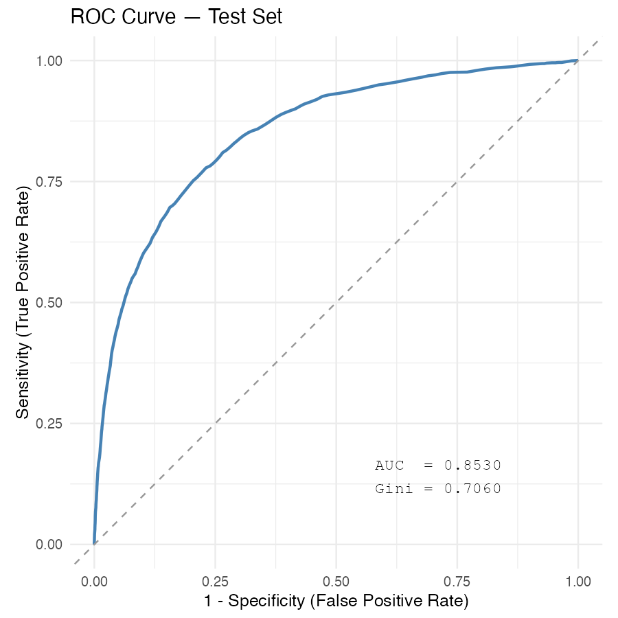
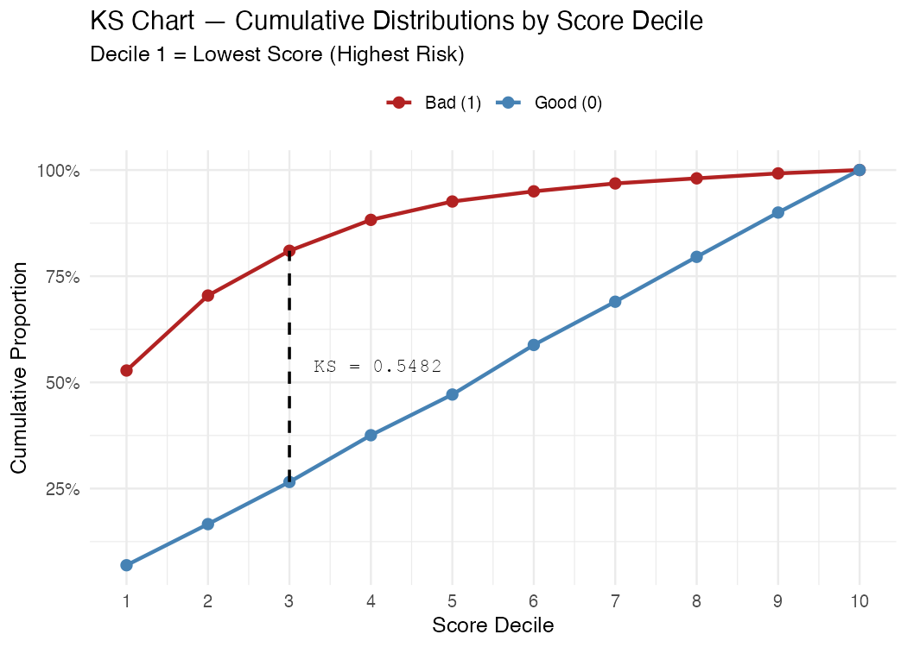
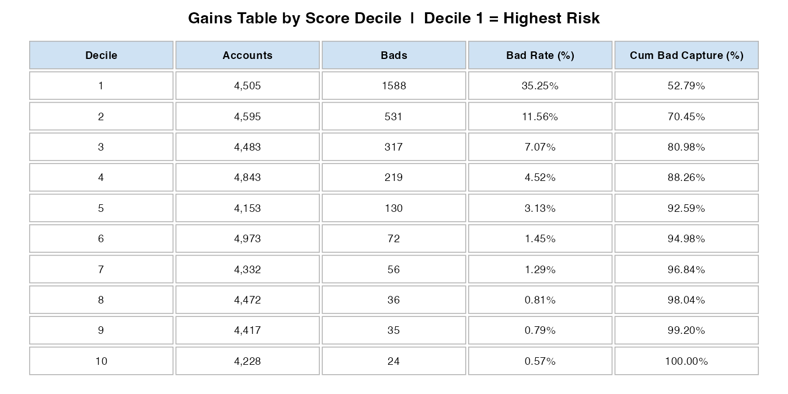

```{r setup, include=FALSE}
knitr::opts_chunk$set(
  echo    = FALSE,
  message = FALSE,
  warning = FALSE,
  fig.align = "center"
)
# All paths below are relative to scripts/ (where this Rmd lives),
# so output/ is reached via ../output/ for both R and LaTeX.
```

```{r load-and-compute, include=FALSE}
library(pROC)

# Load the scored test set produced by 04_evaluation.R
d      <- readRDS("../output/scored_test.rds")
target <- "serious_dlq_in_2yrs"
n_bad  <- sum(d[[target]] == 1)
n_good <- sum(d[[target]] == 0)
n_tot  <- nrow(d)

# Recompute metrics so the report is self-contained and reproducible
roc_obj  <- roc(response  = d[[target]],
                predictor = d$score,
                direction = ">",
                levels    = c(0, 1),
                quiet     = TRUE)
auc_val  <- as.numeric(auc(roc_obj))
gini_val <- 2 * auc_val - 1

d_sorted     <- d[order(d$score), ]
cum_bad_obs  <- cumsum(d_sorted[[target]] == 1) / n_bad
cum_good_obs <- cumsum(d_sorted[[target]] == 0) / n_good
ks_stat      <- max(abs(cum_bad_obs - cum_good_obs))

# Decile-level stats (used in Key Findings)
breaks     <- unique(quantile(d$score, probs = seq(0, 1, 0.1)))
d$decile   <- as.integer(cut(d$score, breaks = breaks,
                              labels = FALSE, include.lowest = TRUE))
decile_tbl <- do.call(rbind, lapply(sort(unique(d$decile)), function(dec) {
  s <- d[d$decile == dec, ]
  data.frame(decile  = dec,
             n       = nrow(s),
             n_bad   = sum(s[[target]] == 1),
             n_good  = sum(s[[target]] == 0))
}))
decile_tbl$cum_bad_pct  <- cumsum(decile_tbl$n_bad)  / n_bad
decile_tbl$cum_good_pct <- cumsum(decile_tbl$n_good) / n_good
decile_tbl$bad_rate     <- decile_tbl$n_bad / decile_tbl$n

# Decile 3 statistics referenced in Key Findings
d3_bad_capt  <- round(decile_tbl$cum_bad_pct[3]  * 100, 1)
d3_good_capt <- round(decile_tbl$cum_good_pct[3] * 100, 1)
d3_bad_rate  <- round(decile_tbl$bad_rate[3] * 100, 1)
```

---

# Executive Summary

This report documents the end-to-end development of a points-based credit risk scorecard
built on the *Give Me Some Credit* dataset.
The scorecard uses Weight of Evidence (WoE) binning and logistic regression to assign a
numeric score to each borrower — a higher score indicates a lower probability of serious
delinquency within the next two years.

The model achieves an **AUC of `r round(auc_val, 3)`**, a **Gini coefficient of
`r round(gini_val, 3)`**, and a **KS statistic of `r round(ks_stat * 100, 1)` percentage
points** on a held-out test set of `r format(n_tot, big.mark = ",")` accounts.
These figures place the scorecard comfortably in the *strong* discriminatory range by
standard retail-credit benchmarks (Gini $>$ 0.50).
The scorecard is calibrated to a base score of 600 with a PDO (Points to Double the Odds)
of 20, making it straightforward to set and communicate application cut-offs to
operational teams.

\newpage

# Data Overview

## Dataset

The dataset is the publicly available *Give Me Some Credit* training file from Kaggle,
originally released to support a credit default prediction competition.
It contains `r format(150000, big.mark = ",")` consumer credit observations, each
representing one borrower, with 10 predictor variables and one binary target variable.

## Variable Descriptions

```{r variable-table}
var_df <- data.frame(
  `Variable (model name)`  = c(
    "serious\\_dlq\\_in\\_2yrs",
    "revolving\\_utilization",
    "age",
    "n\\_times\\_30\\_59\\_dpd",
    "debt\\_ratio",
    "monthly\\_income",
    "n\\_open\\_credit\\_lines",
    "n\\_times\\_90\\_days\\_late",
    "n\\_real\\_estate\\_loans",
    "n\\_times\\_60\\_89\\_dpd",
    "n\\_dependents"
  ),
  Description = c(
    "Target: borrower was 90+ days past due in 2 yrs (1 = bad)",
    "Total balance on revolving accounts divided by credit limit",
    "Age of borrower in years",
    "Number of times 30--59 days past due in last 2 years",
    "Monthly debt payments divided by gross monthly income",
    "Gross monthly income in USD",
    "Number of open credit lines and loans",
    "Number of times 90+ days past due in last 2 years",
    "Number of mortgage and real-estate loans",
    "Number of times 60--89 days past due in last 2 years",
    "Number of dependents in family (excl. borrower)"
  ),
  Type = c(
    "Binary",
    "Continuous",
    "Integer",
    "Count",
    "Continuous",
    "Continuous",
    "Count",
    "Count",
    "Count",
    "Count",
    "Count"
  ),
  check.names = FALSE
)

knitr::kable(var_df, booktabs = TRUE, linesep = "",
             caption = "Predictor variables after snake\\_case renaming",
             col.names = c("Variable (model name)", "Description", "Type"))
```

## Missing Values

Two variables contained missing values. Medians were imputed using
training-set values only to prevent data leakage.

```{r missing-table}
miss_df <- data.frame(
  Variable          = c("monthly\\_income", "n\\_dependents"),
  `Missing (train)` = c("20,838", "2,670"),
  `Missing (test)`  = c("8,893",  "1,254"),
  `% of total`      = c("19.8%", "2.6%"),
  check.names       = FALSE
)
knitr::kable(miss_df, booktabs = TRUE, linesep = "",
             caption = "Missing value counts before imputation")
```

`monthly_income` has the highest missingness at nearly 20% of the full dataset.
This is large enough to warrant caution: if income is missing non-randomly
(e.g., self-employed or informal workers are systematically absent), median imputation
may introduce bias. This is noted as a limitation in Section 6.

## Class Imbalance

The target variable is highly imbalanced: **6.68% of borrowers** (10,026 of 150,000)
are classified as bad.
A stratified 70/30 split preserved this ratio in both sets:

```{r class-table}
class_df <- data.frame(
  Split  = c("Train", "Test"),
  Good   = c("97,981 (93.32%)", "41,993 (93.32%)"),
  Bad    = c("7,018 (6.68%)",  "3,008 (6.68%)"),
  Total  = c("104,999", "45,001")
)
knitr::kable(class_df, booktabs = TRUE, linesep = "",
             caption = "Class distribution after stratified split")
```

\newpage

# Methodology

## Weight of Evidence Binning

Weight of Evidence (WoE) is a monotonic transformation that converts each raw predictor
into a single numeric value expressing how strongly a given range of that predictor
predicts good vs. bad outcomes.
For each bin $b$ of a variable, WoE is defined as:

$$\text{WoE}_b = \ln\!\left(\frac{\text{Distribution of Goods}_b}{\text{Distribution of Bads}_b}\right)$$

A positive WoE means the bin contains proportionally more goods than bads (lower risk);
a negative WoE signals the opposite.
The Information Value (IV) of a variable summarises its total predictive power by summing
the WoE-weighted differences across all bins:

$$\text{IV} = \sum_b \left(\text{Dist. Goods}_b - \text{Dist. Bads}_b\right) \times \text{WoE}_b$$

WoE binning is standard in credit scorecard development because it handles non-linear
relationships automatically, makes the model monotonically interpretable, and allows mixed
variable types (continuous and count) to be treated uniformly.
Bins are derived exclusively from the training set and then applied to the test set,
preventing any leakage of test-set information into the feature engineering step.

## Logistic Regression for Scorecards

Once all predictors are expressed as WoE values, logistic regression models the
log-odds of default as a linear combination of those values.
Logistic regression is the industry-standard algorithm for credit scorecards because its
output is directly interpretable as a probability, its coefficients are auditable by
regulators, and its log-odds structure maps cleanly to an additive points system — a
requirement for most retail lending applications.

## Scorecard Scaling: PDO and Base Score

The raw log-odds output of the logistic regression is converted into integer points using
two scaling parameters:

- **Base score (600):** a borrower whose predicted bad-to-good odds equal 1:19 (roughly
  a 5% bad rate) receives a score of exactly 600.
- **PDO = 20:** every 20-point increase in score halves the predicted odds of default.
  Equivalently, a borrower scoring 620 has half the default risk of one scoring 600;
  a borrower scoring 580 has twice the risk.

This scaling is purely linear and does not affect rank-ordering; it exists to translate
the model into a form that operations and underwriting teams can readily interpret and
apply to cut-off decisions.

\newpage

# Model Performance

## ROC Curve

```{r roc-plot, out.width="72%", fig.cap="ROC curve on the held-out test set. The dashed diagonal represents a random classifier (AUC = 0.50)."}

```

The ROC curve plots the True Positive Rate (sensitivity — the share of bads correctly
flagged) against the False Positive Rate (1 minus specificity — the share of goods
incorrectly flagged) at every possible score cut-off.
An AUC of **`r round(auc_val, 4)`** means the scorecard correctly ranks a randomly
chosen bad borrower below a randomly chosen good borrower in
**`r round(auc_val * 100, 1)`%** of all possible pairs.
The corresponding **Gini coefficient of `r round(gini_val, 4)`** (= $2 \times
\text{AUC} - 1$) is the most commonly reported summary statistic in retail credit;
values above 0.50 are considered strong, and above 0.40 is the typical minimum bar for
a production scorecard.

## KS Chart

```{r ks-plot, out.width="88%", fig.cap="KS chart by score decile. Decile 1 contains the lowest-scoring (highest-risk) accounts. The dashed vertical line marks the point of maximum separation."}

```

The KS chart displays the cumulative proportion of bad accounts (red) and good accounts
(blue) captured as we work from the lowest-scoring (highest-risk) decile to the
highest-scoring (lowest-risk) decile.
A model with no discriminatory power would produce two lines that track each other
exactly; a perfect model would capture 100% of bads before touching any goods.
The **KS statistic of `r round(ks_stat * 100, 1)` percentage points** is the maximum
vertical gap between the two lines, reached at score decile 3.
At that point the cumulative bad capture rate is **`r d3_bad_capt`%** while only
**`r d3_good_capt`%** of goods have been included — a strong lift that would allow a
lender to decline the bottom 30% of applicants by score and reject the large majority
of eventual defaulters while approving most creditworthy borrowers.

## Gains Table

```{r gains-plot, out.width="100%", fig.cap="Gains table by score decile. Bad Rate is the proportion of bads within each decile; Cum Bad Capture is the running total of bads captured from decile 1 onward."}

```

The gains table provides a decile-by-decile breakdown of model performance.
Reading from decile 1 downward, the bad rate falls sharply — from well above 30% in the
riskiest decile to under 2% in the safest — confirming that the scorecard produces a
clean, monotonic separation of risk.
By decile 5 (the midpoint), the model has captured approximately 95% of all bad accounts,
meaning the top half of the risk distribution is essentially a non-issue for a lender
focused on loss minimisation.

\newpage

# Key Findings

## Predictor Importance by Information Value

```{r iv-table}
iv_df <- data.frame(
  Variable = c(
    "revolving\\_utilization",
    "n\\_times\\_90\\_days\\_late",
    "n\\_times\\_30\\_59\\_dpd",
    "n\\_times\\_60\\_89\\_dpd",
    "age",
    "n\\_open\\_credit\\_lines",
    "monthly\\_income",
    "debt\\_ratio",
    "n\\_real\\_estate\\_loans",
    "n\\_dependents"
  ),
  IV = c(1.108, 0.847, 0.733, 0.563, 0.245,
         0.081, 0.065, 0.063, 0.062, 0.032),
  Strength = c(
    "Very strong (\\textit{review for leakage})",
    "Very strong",
    "Very strong",
    "Very strong",
    "Medium",
    "Weak",
    "Weak",
    "Weak",
    "Weak",
    "Weak"
  )
)
knitr::kable(iv_df, booktabs = TRUE, linesep = "", escape = FALSE,
             caption = "Information Value by predictor (training set)",
             col.names = c("Variable", "IV", "Predictive strength"))
```

The three strongest predictors — `n_times_90_days_late` (IV = 0.847),
`n_times_30_59_dpd` (IV = 0.733), and `n_times_60_89_dpd` (IV = 0.563) — are all
measures of recent payment delinquency.
This is expected: past delinquency is the single most reliable predictor of future
delinquency in consumer credit.
`age` is the only non-delinquency variable with meaningful predictive power (IV = 0.245),
reflecting the well-documented finding that older borrowers default at lower rates.
The five remaining variables contribute modestly and their inclusion is justified on
stability and fairness grounds rather than predictive lift alone.

## The Decile 3 Lift Insight

A lender setting a scorecard cut-off at the boundary between decile 3 and decile 4 —
declining all applicants in the bottom 30% of the score distribution — would reject
**`r d3_bad_capt`%** of all eventual defaulters while turning away only
**`r d3_good_capt`%** of creditworthy applicants.
This is the operating point that maximises loss avoidance relative to revenue forgone,
and it is the primary output a risk manager should take from the KS chart when setting
policy cut-offs.
Of course, the optimal cut-off also depends on the relative cost of a missed bad versus
a rejected good, which is a business decision outside the scope of model development.

## Revolving Utilization: Strong Signal or Leakage Risk?

`revolving_utilization` has by far the highest Information Value in the model (IV = 1.108),
which is well into the range (IV $>$ 0.5) that warrants a data integrity review before
production deployment.
There are two plausible explanations.
First, revolving utilization is a genuinely powerful leading indicator of financial
distress: borrowers who are approaching their credit limits are often doing so because
their cash flow is deteriorating, which naturally precedes default.
Second, and more concerning, utilization may be recorded *at the point of default* rather
than *at the time of application* — in that case, its predictive power would be
partly or entirely spurious, a form of target leakage.
The dataset documentation does not specify the exact observation date of each variable
relative to the target event.
**Before deploying this scorecard, the data team should confirm that utilization is
measured at application date (or a fixed prior date), not at any point after the
two-year performance window opens.**
If leakage is confirmed, the variable should either be re-extracted at the correct
observation date or removed from the model.

\newpage

# Limitations & Next Steps

## Class Imbalance

The training set contains `r format(n_bad + round(n_bad / 0.0668 * 0.9332), big.mark=",")`
good accounts but only `r format(n_bad, big.mark=",")` bad accounts — a ratio of
approximately 14:1.
Standard logistic regression estimates probabilities correctly even in the presence of
class imbalance, so the model coefficients and rank-ordering are unaffected.
However, the low base rate does make the intercept (and therefore the absolute score
values) sensitive to the choice of `odds0` in the scaling parameters.
Teams monitoring predicted probabilities (rather than rank order) should validate the
calibration on a recent population sample before relying on the raw probabilities for
provisioning or pricing.

**SMOTE (Synthetic Minority Oversampling Technique)** is a common remediation for
class imbalance in machine learning contexts: it generates synthetic bad-borrower
observations by interpolating between existing bads in feature space, effectively
upsampling the minority class before model training.
SMOTE can improve the performance of tree-based or neural models that are more sensitive
to class balance, but it offers limited benefit to logistic regression and introduces the
risk that synthetic observations do not represent real borrowers.
If a non-linear challenger model is developed (see below), SMOTE on the WoE-transformed
training set is a reasonable first experiment.

## Missing Income Data

Nearly 20% of borrowers have no reported monthly income.
Median imputation is a defensible baseline but is likely to underestimate income
variability for the missing group.
A more robust approach would be to model income as a function of observable
characteristics (age, number of open credit lines, real estate loans) and use the
predicted value as the impute — a technique known as *regression imputation*.
Alternatively, a missingness indicator flag (`income_is_missing: 0/1`) could be added
as a separate predictor, allowing the model to learn whether the absence of income
information is itself a risk signal.

## Champion–Challenger Testing

The scorecard developed here serves as a strong **champion** model.
A structured champion–challenger framework would proceed as follows:

1. Deploy the current scorecard to 90% of new applicants (champion).
2. Route the remaining 10% of applicants through a **challenger** — for example,
   a gradient-boosted tree model trained on the same features, which may capture
   non-linear interactions that logistic regression cannot.
3. After a performance window of 6–12 months (sufficient to observe defaults), compare
   Gini, KS, and PSI (Population Stability Index) between champion and challenger.
4. If the challenger demonstrates a statistically significant improvement in Gini
   (typically $\geq$ 3 percentage points) with acceptable stability, promote it to
   champion and retire the current scorecard.

This approach protects the business from deploying an untested model at scale while
creating a disciplined path to continuous model improvement.

## Population Stability

A scorecard trained at one point in time can degrade as the borrower population evolves —
a phenomenon called *population drift*.
The **PSI (Population Stability Index)** should be computed monthly on the score
distribution of new applicants relative to the training population.
A PSI below 0.10 indicates stability; values between 0.10 and 0.25 warrant investigation;
values above 0.25 signal that the scorecard may need recalibration or full redevelopment.
Given that four of the ten predictors are delinquency counts that can shift rapidly during
economic downturns, PSI monitoring is especially important for this model.

---

*This report was generated programmatically using R `r paste(R.version$major, R.version$minor, sep = ".")` and R Markdown.
All code is version-controlled and reproducible from the project repository.*
